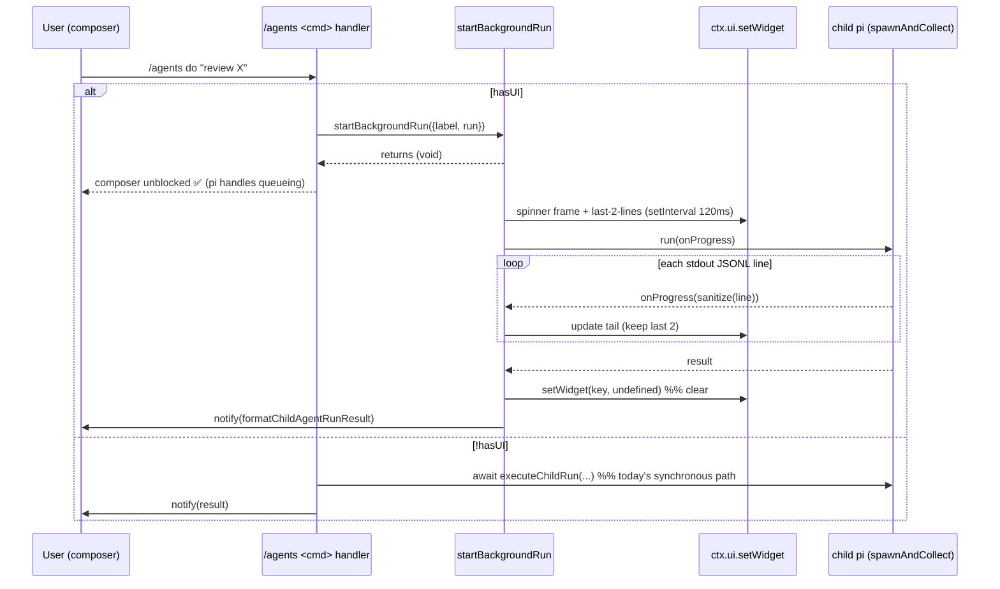

# P8 Non-Blocking In-Process Agent Runs + Live TUI Feedback Plan

## Status

**FINAL plan — awaiting user approval (Rule 18 step 4).** Adversarial review (claude-subagent)
complete and fully integrated; codex second-opinion abandoned on a harness ENOBUFS bug, and the
adversarial pass was accepted as the second opinion (decision 2026-06-21). Do not implement until
the user approves; the plan-approval marker is set.

## Episode Search Summary

Searched episodic memory for: `background`, `non-block`, `widget`, `queue`, `spinner`, `child run`, `do command`, `intent`.

Key active memories:

- `20260619-150638-canonical-workplan…cbe2`: P4-1 (`bg-state.ts`, 537 LOC) merged in PR #44; P4-2 (`bg-preflight.ts`) is the *next* P4 slice. P4 is the **tmux/worker + MAC-manifest** path.
- `20260619-153212-p4r-plan-review-consensus-no-go…83e5`: P4 was **NO-GO until authority-root binding fixed** (manifest `homeDir`/`cwd` made the MAC circular). The authoritative P4 design lives in `P4_REMEDIATION_PLAN.md`.
- `20260615-142731-implemented-p3c-2-built-in-child-runner…524a`: `runBuiltInChildAgent`/`runChildAgent` → `spawnAndCollect` shape; stdout spill-to-file design (P3f-4).
- `20260619-093508-prompt-intent-classification-must-preced…aabd`: `/agents do` runs the classifier child **before** the chosen agent child — two sequential child spawns on the synchronous rail.

**P4 is out of scope and untouched.** P8 is the **in-process, same-process** non-blocking path: it edits
**no P4 file** (`bg-state.ts`, `P4_BACKGROUND_AGENTS_PLAN.md`, `P4_REMEDIATION_PLAN.md`) and **imports
nothing** from `bg-state.ts` — it defines its own local `BG_RUN_MAX_CONCURRENT`. P4 (worker/tmux/MAC-manifest,
cross-session survival) remains a separate, independent workstream. The P4 episodes above are cited only to
explain *why* P8 takes the lighter in-process route; nothing in P8 depends on or modifies P4.

## Objective

Make `/agents do`, `/agents run`, `/agents chain`, and `/agents run-temp` **non-blocking**: the slash-command
handler kicks off the child `pi` run and returns immediately, so the pi composer stays responsive and the
user can keep typing. While a run is in flight, a **display-only widget** shows an animated spinner plus the
last ≤2 lines of child activity. On completion the widget clears and the existing result `notify` fires.

## Why

Today every agent-spawning subcommand `await`s the child run inside the command handler. pi blocks the
composer while a handler promise is pending, so the entire run (up to the agent's timeout — observed **120 s,
`exit=143` SIGTERM** on a real `/agents do` reviewer run) freezes input, and all output lands as one dump at
the end. There is no progress signal. Users cannot queue follow-up prompts, and a long/timed-out run looks
like a hang. Returning control immediately (a) restores pi's native input/queueing and (b) creates the seam
to surface live progress.

## Requirements (Ground Truth)

| ID | Requirement | Test(s) | Priority | Notes |
|---|---|---|---|---|
| REQ-1 | When `hasUI`, the `do`/`run`/`chain`/`run-temp` handler resolves **before** the child run completes | `testHandlerReturnsBeforeChildSettles` | MUST | Child runner is a deferred promise; assert handler resolved while child still pending |
| REQ-2 | Background progress uses **only** `setWidget` + `notify` — never `custom()` or `onTerminalInput` (input stays pi's) | `testNoInputInterception` (grep guard) | MUST | Enforces "queueing is pi's, not ours". Static guard fails if either token appears in `bg-run.ts` |
| REQ-3 | While a run is in flight the widget shows a spinner frame that **advances over time** | `testSpinnerFrameAdvances` | MUST | Fake timers; assert captured frame char differs across two intervals |
| REQ-4 | Widget shows the **last ≤2** synthesized activity lines from child stdout | `testTailKeepsLastTwoLines` | MUST | Feed 3 lines → widget tail has exactly lines 2 and 3 |
| REQ-5 | On **every** settle path (resolve, reject, throw), widget is cleared when registry empties **and** a `notify` fires | `testWidgetClearedAndNotifyOnSettle`, `testWidgetClearedOnRejectPath` | MUST | `finally`-based; covers completed/failed/timed-out/throw (B3) |
| REQ-6 | `onProgress` fires **once per complete stdout line**; partial lines buffered until `\n`; trailing partial flushed on `close` | `testOnProgressLineBuffering`, `testTrailingPartialLineFlushedOnClose` | MUST | Spawner emits `"a\nb"` then `"c\n"` → `"a"`,`"bc"`; `"abc"`+close → `"abc"` |
| REQ-7 | Widget/notify text is **control-char-stripped + truncated** before render (no terminal-escape injection from child stdout) | `testProgressLineSanitized` | MUST (Safety) | Feed `"\x1b[2Jx"` → rendered line has no `\x1b`; ≤ `MAX_TAIL_LINE_CHARS` |
| REQ-8 | `!hasUI` falls back to today's **synchronous await** — zero widget calls | `testNoUiFallbackSynchronous` | MUST | RPC/print mode + `run_subagent` callers unaffected |
| REQ-9 | The tool path (`run_subagent`) and **chain step** execution stay synchronous (result returned inline) | `testToolPathDoesNotBackground` (spy: `startBackgroundRun` not called), `testChainStepOnProgressDoesNotAlterHandoff`; existing `test-subagent-tool.*`, `test-chain-runner.*` stay green | MUST | Backgrounding added at command layer only, never inside `executeChildRun`/`runChain` |
| REQ-10 | In-process concurrency capped at `BG_RUN_MAX_CONCURRENT = 5`; the 6th is **rejected with a notify** (not queued/dropped); a settled run **frees its slot on every path** | `testConcurrencyCapRejects`, `testCapDecrementsOnReject` | SHOULD | Start 6 → 6th notifies cap; a thrown run frees its slot (B3) |
| REQ-11 | pi shutdown clears the interval timer **and** the widget (no leaked timer) | `testShutdownClearsTimerAndWidget` | MUST | `SessionShutdown` handler calls `clearInterval` + `setWidget(key, undefined)` |
| REQ-12 | `onProgress` threading is **zero behavior change** when absent (default `undefined`) | existing `test-child-runner.*` stay green | MUST | Pure plumbing; default path identical |

**Priority legend:** MUST = required for first slice merge; SHOULD = before feature complete; MAY = nice-to-have.

## Non-Goals

- Cross-session persistence / survival across pi restart (that is **P4** — worker + `bg-state.ts` on disk).
- tmux / pluggable terminal backend (P5), MAC-signed manifests, worker re-derivation of authority (P4/P4R).
- Cancelling a running background run from the composer (possible follow-up; see Open Decisions).
- Scrollback/history view of completed runs beyond the final `notify`.
- Backgrounding the `run_subagent` tool or individual chain steps (they need inline results — REQ-9).

## Safety / Security

No new authority surface: children are still spawned through the existing `buildChildPiArgs` read-only rail
(`--tools read,grep,find,ls`, `--no-approve`, etc.); P8 adds **no** new flags, env, or trust material. The one
new surface is **rendering untrusted child stdout into the TUI widget**.

| Concern | Severity | Mitigation | Test(s) |
|---|---|---|---|
| Terminal-escape / ANSI injection from child stdout into widget or notify | Medium | `sanitizeProgressLine()` strips C0 `\x00-\x1f`, `\x7f`, **and C1 `\x80-\x9f`** (catches the 1-byte CSI `\x9b`) and truncates to `MAX_TAIL_LINE_CHARS = 200` **before** any `setWidget`/`notify`. Lines are decoded from the byte buffer only **after** a full `\n` (N3), so a UTF-8/CSI sequence split across chunks cannot smuggle through | `testProgressLineSanitized` (positive: `\x1b` **and** `\x9b` stripped; **negative control**: an unsanitized impl still contains `\x1b`/`\x9b`) |
| Input capture / focus theft changing what the user types | Medium | Display-only `setWidget`; **forbid** `custom()`/`onTerminalInput` in `bg-run.ts` | `testNoInputInterception` grep guard (RED if either token present) |
| Unbounded in-process runs exhausting the machine | Low | `BG_RUN_MAX_CONCURRENT = 5` cap, 6th rejected | `testConcurrencyCapRejects` |
| Leaked `setInterval` keeping the event loop alive after shutdown | Low | `SessionShutdown` clears timer + widget; timer `.unref()` so it never blocks exit | `testShutdownClearsTimerAndWidget` |

## Design

### Host API verification (resolves adversarial B1)

The widget/shutdown primitives are **verified present** in the installed pi host
(`@earendil-works/pi-coding-agent`), not assumed:

- `ExtensionUIContext.setWidget(key, string[] | undefined, { placement })` — `core/extensions/types.d.ts:96`.
- `WidgetPlacement = "aboveEditor" | "belowEditor"` — `types.d.ts:42`.
- `on(event: "session_shutdown", handler)` + `SessionShutdownEvent` — `types.d.ts:816`, `:439`.
- Registration mechanism already used by this extension: `eventApi.on?.("session_start", …)` — `agents/index.ts:50`.

The reason `setWidget` "looks" absent is that the extension's own `AgentsContext.ui` (`index.ts:44-47`)
and `AgentsContextLike.ui` (`run-resolver.ts:28-31`) **narrow** the host ui to `notify`/`confirm`. The
runtime object passed to the command handler is the host `ExtensionCommandContext` (full ui), so widening
the type re-exposes `setWidget`. **Defensive guard:** every call site checks `typeof ui.setWidget === "function"`
and no-ops gracefully on a host version that lacks it (so a missing API degrades to "non-blocking run, no
widget", never a crash). P8-0 (below) asserts presence before P8-2 builds.

### Key types

```ts
// agents/lib/bg-run.ts
export const BG_RUN_MAX_CONCURRENT = 5;
export const MAX_TAIL_LINE_CHARS = 200;
export const SPINNER_FRAMES = ["◐", "◓", "◑", "◒"] as const;   // user's "rotating circle"
export const SPINNER_INTERVAL_MS = 120;
const WIDGET_KEY = "agents:bg-runs";

/** Minimal UI surface bg-run is allowed to touch — display + notify ONLY.
 *  Deliberately omits custom()/onTerminalInput so input stays pi's (REQ-2). */
export type BgRunUI = {
  setWidget(key: string, content: string[] | undefined, options?: { placement?: "aboveEditor" | "belowEditor" }): void;
  notify(message: string, level?: "info" | "warning" | "error" | string): void;
};

export type BgRunHandle = {
  /** Push a synthesized activity line; keeps last 2 (REQ-4). */
  onProgress(line: string): void;
};

/** Fire-and-forget. Returns immediately (REQ-1). `run` receives an onProgress sink
 *  and resolves to the human-readable result string to notify on settle (REQ-5). */
export function startBackgroundRun(args: {
  ui: BgRunUI;
  label: string;                       // e.g. "do→reviewer", "chain:scout"
  run: (handle: BgRunHandle) => Promise<{ message: string; level: "info" | "warning" | "error" }>;
  now?: () => number;                  // injectable clock (tests)
  setInterval?: typeof setInterval;    // injectable timer (tests)
  clearInterval?: typeof clearInterval;
}): void;

/** Registered on SessionShutdown — clears timer + widget (REQ-11). */
export function disposeBackgroundRuns(ui: Pick<BgRunUI, "setWidget">): void;
```

```ts
// agents/lib/child-runner.ts — additive option (REQ-6, REQ-12)
export type RunBuiltInChildAgentOptions = ChildPiArgsOptions & {
  /* …existing… */
  onProgress?: (line: string) => void;   // called once per complete stdout line; default undefined = no-op
};
```

### Key invariants

- **Backgrounding is a command-layer concern.** `executeChildRun`, `runChildAgent`, `runChain`, and the
  `run_subagent` tool stay synchronous. Only the four command handlers wrap their call in `startBackgroundRun`.
- **bg-run never reads input.** Its only host calls are `setWidget` and `notify`.
- **`onProgress` is opt-in and side-effect-free when absent** — the spill/summarize path is byte-identical to today.
- **All rendered text is sanitized** (`sanitizeProgressLine`) before reaching the host.
- **Single shared widget** keyed `agents:bg-runs`; lines = one row per active run; cleared to `undefined` when none remain.

### Resolution / flow



### Activity-line synthesis

`summarizeProgressLine(raw): string | undefined` — best-effort, never throws:
1. `JSON.parse(raw)`; on failure return `sanitize(raw)` truncated.
2. If the event is a tool call → `"→ " + toolName + " " + argsPreview` (reuse the field shape `jsonl-monitor.ts` already parses).
3. If assistant text → first `MAX_TAIL_LINE_CHARS` chars.
4. Otherwise `undefined` (skipped — does not push to tail).

## Existing Hook Points

| File | Line(s) | What it does | Impact |
|---|---|---|---|
| `agents/lib/child-runner.ts` | L50 `RunBuiltInChildAgentOptions` | child run options | Add `onProgress?` |
| `agents/lib/child-runner.ts` | ~L156 `spawnAndCollect(...)` call | passes limits | Forward `onProgress` |
| `agents/lib/child-runner.ts` | L205 `spawnAndCollect` options | options bag | Add `onProgress?` to options type |
| `agents/lib/child-runner.ts` | ~L310 `child.stdout.on("data")` | counts bytes, spills | Add newline buffer → `onProgress(line)` |
| `agents/lib/run-resolver.ts` | L83 `executeChildRun` | runs one child, notifies | Add optional `onProgress` param, forward |
| `agents/lib/run-resolver.ts` | L211 `runIntentCommand` (`do`) | classifier + agent | Wrap agent run in `startBackgroundRun` when `hasUI` |
| `agents/lib/run-resolver.ts` | L104 `runAgentCommand` (`run`) | one agent | Same wrap |
| `agents/lib/chain-runner.ts` | L132 `runChain` / L209 `runChainCommand` | N steps | Wrap whole chain in one bg run; forward per-step `onProgress` |
| `agents/lib/ephemeral.ts` | ~L114 `runEphemeralCommand` (`run-temp`) | ephemeral agent | Same wrap |
| `agents/index.ts` | L156-173 handler dispatch | calls the four commands | Pass `setWidget`-capable `ui`; widen `AgentsContextLike.ui` |
| `agents/index.ts` | session shutdown hook | — | Register `disposeBackgroundRuns` |

## Slice Ladder

| Slice | Objective | Primary files | Key deliverables | Tests | Hard stops |
|---|---|---|---|---|---|
| `P8-0` | **Spike / hard gate** (resolves adversarial B1 + B2) | throwaway extension probe | (a) confirm returning early from a command handler unblocks the composer (one-line handler + 10 s `setTimeout` notify; type mid-run); (b) assert `typeof ctx.ui.setWidget === "function"` **and** a `session_shutdown` registration succeeds at runtime | manual: typing works mid-run; `node -e` presence assert on host typings | **STOP the plan** if (a) is false (escalate is out of scope); re-scope P8-2 if (b) is false |
| `P8-1` | `onProgress` plumbing (zero behavior change) | `child-runner.ts` | **separate local** newline buffer in the `data` handler → per-line callback; **flush trailing partial on `close`**; never touches `stdoutBytes`/spill/watermark (N3) | `testOnProgressLineBuffering`, `testTrailingPartialLineFlushedOnClose`, `testOnProgressDoesNotChangeStdoutBytes`; existing suite green | None |
| `P8-2` | `bg-run.ts` module | `bg-run.ts` (new) | registry, spinner+tail widget, sanitize (C0+C1), cap w/ `finally` decrement, dispose; **render-only** | `testSpinnerFrameAdvances`, `testTailKeepsLastTwoLines`, `testProgressLineSanitized`, `testWidgetClearedAndNotifyOnSettle`, `testWidgetClearedOnRejectPath`, `testConcurrencyCapRejects`, `testCapDecrementsOnReject`, `testShutdownClearsTimerAndWidget`, `testNoInputInterception` | Requires P8-0(b) green |
| `P8-3` | Wire 4 command handlers **(focused review before build — touches shared command surface)** | `run-resolver.ts`, `chain-runner.ts`, `ephemeral.ts`, `index.ts` | `startBackgroundRun` wrap behind `hasUI` + `setWidget` guard; widen `ui` type; **`do` classifier+confirm still block (N1)**; **chain: thread `onProgress` through `runChain` + `buildChildRunOptions` — a real signature change, not additive (N2)**; tool/sync path untouched | `testHandlerReturnsBeforeChildSettles`, `testNoUiFallbackSynchronous`, `testToolPathDoesNotBackground`, `testChainStepOnProgressDoesNotAlterHandoff`; existing subagent/chain suites green | Requires P8-0(a) green |
| `P8-4` | Shutdown cleanup + docs | `index.ts`, `agents/README.md`, `docs/USER_MANUAL.md` | `disposeBackgroundRuns` on `session_shutdown`; doc the live indicator | `testShutdownClearsTimerAndWidget` (wired); manual smoke | None |

### Dependency graph

```text
P8-0 (gate) ── P8-1 ── P8-2 ── P8-3 ── P8-4
                  └─ P8-2 also requires P8-0(b); P8-3 requires P8-0(a)
```

## Cut Order

If scope grows, cut in this order:

1. Concurrency cap (REQ-10, SHOULD) — degrade to "always allow" with a one-line `log`.
2. Activity-line synthesis richness — fall back to raw sanitized/truncated line only.
3. `run-temp` and `chain` wiring — ship `do` + `run` first (still covers the reported bug).

Do not cut:

- REQ-1 (non-blocking), REQ-2 (no input interception), REQ-7 (sanitize), REQ-8 (`!hasUI` fallback), REQ-9 (tool/step stay sync).

## Contracts

### `startBackgroundRun(args): void`

**Input contract:** `ui` exposing `setWidget`+`notify`; `label` non-empty; `run` returns a settle message+level. `now`/timer injectable.

**Output contract:** returns `void` **synchronously** (REQ-1). Internally wires `run(handle).then(notifySettle).catch(notifyError)` with **deregister + cap-decrement + maybe-clear-widget in a `finally`** so *every* settle path (resolve, reject, throw-before-spawn) frees the slot and clears the widget when the registry empties. A leaked slot would fail the cap closed after 5 failures, so the `finally` is load-bearing (adversarial B3).

**State table (exhaustive):**

| State | Condition | Output |
|---|---|---|
| A. Accepted | active runs < 5 | run registered, widget shows it, returns void |
| B. Rejected | active runs == 5 | `notify("Too many background agent runs (5). Wait for one to finish.","warning")`, no run started, **no slot consumed** |
| C. Progress | `handle.onProgress(line)` | tail updated to last 2 sanitized lines |
| D. Settled (resolve) | `run` resolves | `notify(message,level)`; **`finally`**: deregister, decrement, clear widget if empty |
| E. Settled (reject/throw) | `run` rejects or throws | `notify(error,"error")`; **`finally`**: deregister, decrement, clear widget if empty (same as D) |

**Error codes:**

| Code | Field | Trigger |
|---|---|---|
| `bg-run-cap` | (notify) | active runs == `BG_RUN_MAX_CONCURRENT` |

## Edge Cases

| # | Scenario | Expected behavior | Test |
|---|---|---|---|
| EC1 | `run` throws (spawn-error) | settle as error notify; widget still cleared | `testWidgetClearedAndNotifyOnSettle` |
| EC2 | child emits no `\n` before close | trailing partial line **flushed on close** (not dropped); spinner shown; settle notifies | `testTrailingPartialLineFlushedOnClose` |
| EC3 | child stdout line > 200 chars | truncated to `MAX_TAIL_LINE_CHARS` | `testProgressLineSanitized` |
| EC4 | line carries ANSI/control bytes | stripped before render | `testProgressLineSanitized` |
| EC5 | two runs active, one settles | widget keeps the other; not cleared | `testTailKeepsLastTwoLines` (multi-run variant) |
| EC6 | `!hasUI` | synchronous await, no `setWidget` calls | `testNoUiFallbackSynchronous` |

## Test Case Catalog

```text
Group 1: child-runner plumbing (3)
  testOnProgressLineBuffering
  testTrailingPartialLineFlushedOnClose      (N3 — flush partial on close)
  testOnProgressDoesNotChangeStdoutBytes     (N3/REQ-12 — byte-identical w/ vs w/o onProgress)

Group 2: bg-run module (8)
  testSpinnerFrameAdvances
  testTailKeepsLastTwoLines
  testProgressLineSanitized                  (asserts \x1b AND \x9b stripped — N4)
  testWidgetClearedAndNotifyOnSettle
  testWidgetClearedOnRejectPath              (B3 — reject branch clears + notifies error)
  testConcurrencyCapRejects
  testCapDecrementsOnReject                  (B3 — thrown run frees its slot)
  testShutdownClearsTimerAndWidget

Group 3: input safety (1)
  testNoInputInterception   (grep guard over bg-run.ts: no onTerminalInput/custom()

Group 4: command wiring (4)
  testHandlerReturnsBeforeChildSettles
  testNoUiFallbackSynchronous
  testToolPathDoesNotBackground              (REQ-9 — spy: startBackgroundRun NOT called by run_subagent)
  testChainStepOnProgressDoesNotAlterHandoff (N2/REQ-12 — chain handoff byte-identical)
```

Total: 16 tests. (Existing child-runner / chain / subagent suites must also stay green — REQ-9, REQ-12.)

## Risk Analysis

| Risk | Severity | Mitigation |
|---|---|---|
| Returning from the handler does **not** re-enable the composer (host couples handler-promise to input lock) | High | **P8-0 gate (moved before P8-1, per B2)**: one-line handler returns immediately + 10 s `setTimeout` notify; confirm typing works mid-run **before** any plumbing is built. STOP the plan if false. |
| `setWidget`/`session_shutdown` absent on the host (B1) | Low (verified present) | Verified in typings (`types.d.ts:96/816/42`); runtime `typeof ui.setWidget === "function"` guard degrades to "no widget" not a crash; P8-0(b) asserts presence |
| `setWidget` from a settled-but-detached async context invalid after session switch | Medium | Guard each render in try/catch; dispose on `session_shutdown`; skip render if registry entry already removed |
| onProgress edit perturbs `stdoutBytes`/spill/watermark (breaks REQ-12) | Medium | Separate local line buffer only; `testOnProgressDoesNotChangeStdoutBytes` asserts byte-identical (N3) |
| `summarizeProgressLine` cost on high-volume stdout | Low | Per-line, bounded; only runs when `onProgress` present |

## Open Decisions

- **Cancel-from-composer** (e.g. `/agents stop <id>`): deferred to a follow-up slice; not required for the reported bug. Rationale: needs a run-id surface + signal plumbing already present in `bg-state` but out of P8 scope.
- **Spinner glyph set**: `◐◓◑◒` chosen per user ("rotating circle"). Revisit if a theme renders them poorly (fallback `|/-\`).

## Done Criteria

- [ ] All MUST requirements have a passing automated test.
- [ ] `/agents do|run|chain|run-temp` return immediately under `hasUI`; composer accepts input mid-run (manual smoke documented).
- [ ] Existing `child-runner`, `chain-runner`, `subagent-tool` suites green (REQ-9/REQ-12).
- [ ] `grep -nE 'onTerminalInput|custom\(' agents/lib/bg-run.ts` returns nothing (REQ-2).

## Review Consensus

| Pass | Reviewer | Model | Blocker count | Verdict |
|---|---|---|---|---|
| 1 | claude-subagent (adversarial) | `claude` (Agent tool) | 3 | changes-requested → **all resolved below** |
| 2 | codex (second-opinion) | `openai-codex/gpt-5.5` | — | **abandoned** — harness ENOBUFS (provider `spawnSync` has no `maxBuffer`; verbose stderr >1 MB → null exit mid-review). Per decision 2026-06-21, the adversarial pass stands as the accepted second opinion. |

### Resolved blockers

| # | Blocker | Resolution |
|---|---|---|
| B1 | `ui.setWidget`/`session_shutdown`/placement treated as unverified host capability | **Refuted with evidence** — present in `types.d.ts:96/816/42`; extension's own `ui` type merely narrows it. Added "Host API verification" section, `typeof setWidget==='function'` runtime guard, and a P8-0(b) presence assert. Downgraded to Low risk. |
| B2 | Composer-unblock spike gated *after* P8-2 (6 tests wasted if false) | Spike promoted to **P8-0 hard gate** before P8-1/P8-2; P8-2 requires P8-0(b), P8-3 requires P8-0(a). |
| B3 | Cap decrement / widget clear not guaranteed on reject/throw | Contract now mandates **`finally`-based** deregister+decrement+maybe-clear; added `testCapDecrementsOnReject` + `testWidgetClearedOnRejectPath`. |
| N1 | `do` classifier + confirm still block | Documented in P8-3 row + Design; only the chosen-agent run backgrounds (acceptable v1). |
| N2 | chain `onProgress` is a signature change, not "additive" | P8-3 row now scopes threading through `runChain` + `buildChildRunOptions`; preflight notifies kept inside bg closure; `testChainStepOnProgressDoesNotAlterHandoff` added. |
| N3 | onProgress must not perturb byte-count/spill; flush trailing line | Separate local buffer; flush-on-close; `testOnProgressDoesNotChangeStdoutBytes` + `testTrailingPartialLineFlushedOnClose`. |
| N4 | sanitize misses C1 `\x80-\x9f` | Strip extended to C1; `testProgressLineSanitized` asserts `\x9b` stripped. |

## Appendix: Implementation Plan

### Files to create

1. `agents/lib/bg-run.ts` — in-process run registry + spinner/tail widget controller (render-only).
2. `agents/test-fixtures/test-bg-run.mjs` — Group 2 + Group 3 tests.
3. `agents/test-fixtures/run-p8-tests.sh` — slice test runner.

### Files to modify

| File | Change |
|---|---|
| `agents/lib/child-runner.ts` | Add `onProgress?` to options; newline-buffer in `data` handler; forward into `spawnAndCollect` |
| `agents/lib/run-resolver.ts` | `executeChildRun` accepts/forwards `onProgress`; `do`/`run` handlers wrap in `startBackgroundRun` when `hasUI`; widen `AgentsContextLike.ui` |
| `agents/lib/chain-runner.ts` | `runChainCommand` wraps the chain in one bg run; forward per-step `onProgress` with step label |
| `agents/lib/ephemeral.ts` | `runEphemeralCommand` wraps in `startBackgroundRun` when `hasUI` |
| `agents/index.ts` | Pass `setWidget`-capable `ui`; register `disposeBackgroundRuns` on `SessionShutdown` |
| `agents/test-fixtures/test-child-runner.mjs` | Add `testOnProgressLineBuffering` |
| `agents/README.md`, `docs/USER_MANUAL.md` | Document the live background indicator |

### Implementation sequence

| Step | Action | Validation |
|---|---|---|
| 1 | P8-1 plumbing + `testOnProgressLineBuffering` | new test green; existing child-runner suite green |
| 2 | P8-2 `bg-run.ts` + Group 2/3 tests | 7 tests green |
| 3 | **Spike**: composer-unblock manual check | typing works during a 10 s fake run |
| 4 | P8-3 wire 4 handlers + Group 4 tests | handlers return early; sync suites green |
| 5 | P8-4 shutdown cleanup + docs | `testShutdownClearsTimerAndWidget` wired; manual smoke |

### Risks

| Risk | Mitigation |
|---|---|
| Composer stays locked despite early return | Spike (step 3) before P8-3 build; fall back to P4 if false |
| Widget API differs from typings at runtime | Guard `setWidget` calls in try/catch; smoke in TUI |

> **Appendix B (mechanical execution spec)** with verbatim anchors will be finalized **after** plan +
> adversarial review, since P8-3 is flagged "focused review before build" and the spike (step 3) may
> adjust the wiring shape. Authoring it now would bake in a wiring that review could change.

---

## P8 follow-up: result → conversation context (all dispatch paths)

Shipped after the progress-widget slices (commit #66). The background widget tells the *user* a run
finished, but the *model* never saw the findings — so the parent agent couldn't react to a review.
This follow-up feeds a completed (or failed) child run back into pi's conversation so the model picks
up from there.

**Mechanism.** `ctx.deliverResult(content)` → `pi.sendUserMessage(content, { deliverAs: "followUp" })`
(always triggers a turn; queues politely if pi is busy). The payload is built by
`formatAgentResultForContext` (`child-runner.ts`): NL summary + compact tool list on success, or a
framed error for the model to interpret on failure. `executeChildRunResult` (`run-resolver.ts`) calls
it on every settle path, guarded by `typeof ctx.deliverResult === "function"`.

| Req | Requirement | Test | Level | Notes |
|---|---|---|---|---|
| REQ-F1 | A completed/failed run is injected into pi's conversation via `deliverResult` on **every** dispatch path that can reach `hasUI` | `test-p8` delivery tests; `testGate_inputHookReattachesDeliverResult` | MUST | The guard is `typeof ctx.deliverResult === "function"`; an unwired ctx drops the result **silently** |
| REQ-F2 | `deliverResult` is wired for **both** the `/agents` command handler **and** the natural-language `input`-gate path (P7-2) | `testGate_inputHookReattachesDeliverResult` | MUST | Both handlers get a **fresh ctx** without it — same class as the `profileLibrary` re-attach gap |
| REQ-F3 | Non-UI / tool / chain-step callers are unaffected (no `sendUserMessage`, sync result) | existing `test-subagent-tool`, `test-chain` stay green | MUST | `sendUserMessage` absent off-TUI → `deliverResult` stays undefined → guard no-ops |

**Wiring (single helper, no drift).** `attachDeliverResult(pi, ctx)` in `index.ts` is the one place
that binds `sendUserMessage`. It is called at `session_start` (onto the session ctx) and in the
`/agents` command handler. The NL-gate path can't take a fresh per-event ctx straight to dispatch, so
`handleGateInput` **re-attaches `deliverResult` from `sessionCtx`** right beside its existing
`profileLibrary` re-attach — keeping the two fresh-ctx gaps fixed by the same pattern.

**Bug fixed here.** The NL-gate path (typing "review this code" rather than `/agents run reviewer …`)
dispatched with the input-event ctx, which never had `deliverResult`. The reviewer ran, the user saw
the operator toast, but the findings were **never injected into context** — the model stayed unaware.
Regression: `testGate_inputHookReattachesDeliverResult` (positive: re-attached from `sessionCtx`;
negative control: absent without `sessionCtx`, reproducing the silent drop).
